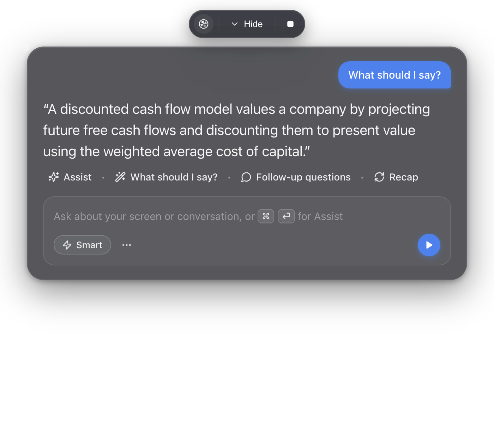

# Sidecar

A desktop overlay copilot for live calls and interviews. It listens to both sides of a conversation,
watches your screen when you ask it to, and streams answers into a transparent panel that floats
above everything else.

Open source, MIT, bring your own API key. **There is no backend.** Everything runs on your machine
against your own keys — see [PRIVACY.md](PRIVACY.md) for exactly what goes where.



> [!IMPORTANT]
> Using this in an interview or exam may violate the rules you agreed to. That is your call to make,
> and your consequence to carry. Recording other people may also require their consent where you
> live. This project does not work on evading detection.

## What it does

- **Hears both sides.** Microphone and system-loopback audio are transcribed on separate channels,
  so the transcript knows who said what.
- **Answers from your actual background.** Drop in your résumé; Sidecar distils it into a profile
  and a bank of STAR stories, and answers are grounded in them. It is instructed never to invent an
  employer, a project, or a metric you do not have.
- **Watches your screen when asked.** Assist and Solve-code attach a screenshot. You choose the
  monitor, window, or a dragged-out region.
- **Speaks in points, not paragraphs.** The default answer shape is 3–5 short bullets, because
  nobody can read prose while talking.
- **Optionally answers on its own.** Auto-answer detects a question from the other side and responds
  without a hotkey. Off by default, and interlocked so it cannot drain a free tier.
- **Keeps a record.** Every session saves its transcript and answers, exportable to Markdown, text,
  or JSON, with a retention setting including "never persist".

## Honest limitations

- Answers are only as good as the model you point it at. On a free text-only model, screenshots are
  dropped and answers are generic.
- Transcription quality drops with cheap microphones, crosstalk, and heavy accents. The batch engine
  adds a second or two of latency by design; the streaming engines are faster but need their own key.
- The streaming transcription adapters (Deepgram, AssemblyAI, OpenAI Realtime) are written to each
  vendor's documented protocol but have not been exercised against a live account by the maintainer.
  Reports welcome.
- Content protection hides the window from screen capture on Windows 10 build 19041+ and on macOS.
  On older Windows it becomes a black rectangle. It is a convenience, not a guarantee.
- Linux system-audio loopback depends on your PipeWire/PulseAudio setup and is the least tested path.
- There is no renderer test suite. Visual regressions are caught by looking.

## Install

Download the latest Windows installer from
[Releases](https://github.com/sohan-a11y/sidecar/releases), or run from source:

```bash
git clone https://github.com/sohan-a11y/sidecar.git
cd sidecar
npm install
npm run build
npm start
```

Node 20 or later. macOS and Linux run from source; only Windows has a packaged build today.

## Setting up your keys

Sidecar ships with no credentials and cannot work without at least one key of your own.

1. Launch it and open **Settings** (the gear in the composer).
2. **Models** — pick a chat provider, paste its key, and choose a model. The model list is fetched
   live from the provider.
3. **Speech** — pick a transcription engine. `Batch` reuses your OpenAI or Gemini key; the streaming
   engines need their own.
4. **Context** — drop in your résumé and press *Build profile*. Without this, answers are generic,
   and the composer says so.
5. Fill in the role, company, and job description for the session you are about to have.

Keys are encrypted with your OS keychain (DPAPI, Keychain, libsecret) and are never sent to the
app's own UI process, let alone anywhere else.

## Providers

| Provider | Chat | Vision | Transcription | Notes |
|---|:---:|:---:|:---:|---|
| OpenAI | ✅ | ✅ | ✅ | `whisper-1` for batch, realtime models for streaming |
| Anthropic | ✅ | ✅ | — | Prompt caching is used for the profile block |
| Google Gemini | ✅ | ✅ | ✅ | Every `generateContent` model accepts images |
| TokenRouter | ✅ | per model | — | Model list fetched live; free models preferred on fallback |
| Custom (OpenAI-compatible) | ✅ | per model | ✅ | Ollama, LM Studio, vLLM, OpenRouter — you supply the base URL |
| Deepgram | — | — | ✅ streaming | `multi` mode handles code-switched speech |
| AssemblyAI | — | — | ✅ streaming | English-first |

Vision is tracked per model. If your chat model cannot accept images, Sidecar routes screenshots to
a vision model you nominate, or drops the image and tells you — it never sends an image part to a
model that will reject it.

## Shortcuts

| Action | Default |
|---|---|
| Assist | `Ctrl/Cmd + Enter` |
| Solve code on screen | `Ctrl/Cmd + H` |
| Start listening and assist | `Ctrl/Cmd + G` |
| Hide / show the overlay | `Ctrl/Cmd + Shift + H` |
| Quit | `Ctrl/Cmd + Shift + X` |

All remappable in **Settings → Screen**, with conflict detection.

## Architecture

```
┌─────────────────────────────────────────────────────────────┐
│ Renderer (React)                                            │
│   App.jsx · transcript pane · settings · VAD segmenter      │
└───────────────┬─────────────────────────────────────────────┘
                │  IPC only (contextIsolation on, no node in renderer)
┌───────────────┴─────────────────────────────────────────────┐
│ Main (Electron)                                             │
│                                                             │
│  MediaCapture ──▶ TranscriptionService ──▶ stt/ adapters    │
│                            │                 (ws sockets)   │
│                            ▼                                │
│                     SessionManager ◀── ContextStore         │
│                            │                 │              │
│                            ▼                 ▼              │
│  QuestionDetector ──▶ PromptBuilder ──▶ LlmService          │
│         │                                    │              │
│    AutoAnswer                          RateLimiter          │
│                                              ▼              │
│                                       providers/ adapters   │
└─────────────────────────────────────────────────────────────┘
```

Two rules hold the whole thing together: every model call goes through `RateLimiter.schedule()`, and
every prompt is composed by `PromptBuilder.build()`. API keys never leave the main process.

Decisions worth knowing about are recorded in [docs/adr/](docs/adr/). The phased build spec is in
[docs/BUILD-PLAN.md](docs/BUILD-PLAN.md).

## Contributing

Read [CONTRIBUTING.md](CONTRIBUTING.md) first — it covers the dev setup, the phase model, and the
handful of rules that will break the app if ignored. Security issues go through
[SECURITY.md](SECURITY.md), privately.

By participating you agree to the [Code of Conduct](CODE_OF_CONDUCT.md).

## Licence

MIT — see [LICENSE](LICENSE).
